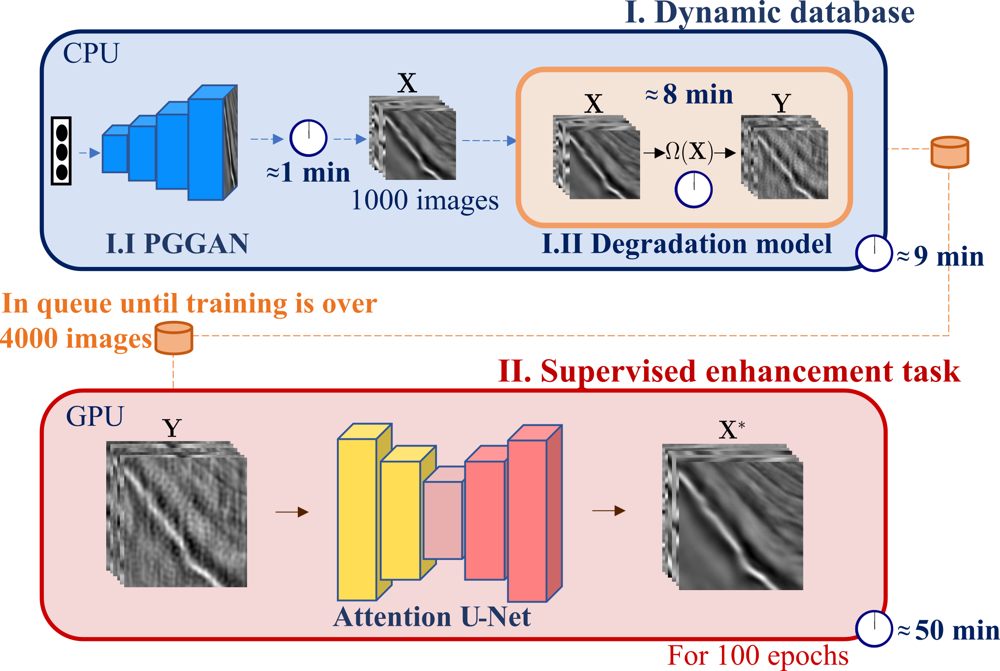

# Post-stack Seismic Data Preconditioning via Dynamic Guided Learning

This work proposes a dynamic-guided learning workflow that utilizes a dynamic database, which continuously generates both clean and noisy patches during training. This database guides the learning of a supervised enhancement task. By introducing variability into the training data, the method significantly improves generalization, ensuring it is not dependent on specific known distributions and eliminates the need for external datasets.   

**Proposed method**



<div style="text-align: justify"> 
<b>Figure 1.</b> Shows the proposed seismic denoising scheme with its two main processes. <b>The Dynamic Database</b> process starts with a Progressive Growing GAN (PGGAN) generating seismic images on the CPU, which takes approximately 1 minute for a batch size of 1000 clean images X. The generated images are then degraded using a <b>degradation operator</b>, which takes around 8 minutes to transform the batch into its degraded version Y. Meanwhile, the <b>images from the dynamic database are used to train an Attention U-Net model on the GPU</b>, involving 100 epochs for each batch of images. While the training is ongoing, a new batch is being synthesized by the Dynamic Database, which is then queued until the current training cycle is complete. This workflow is repeated for a defined number of cycles (in this case, 15), ensuring that while the model is being trained, <b>new training data is being prepared simultaneously</b>, optimizing the training process.
</div>

<hr/>

**How to use**

To install the project packages, you can use Anaconda.
```
conda env create -f environment.yml
```
or python.
```
pip install -r requirements.txt
```

**Comparison metrics**

Comparison metrics for the implemented 16 types noises.
 
 PSNR (dB)            | Gaussian | Poisson | Speckle | Salt and pepper | Linear | Waves/diffraction | Stripes | Correlated g1 | Correlated g2 | Blur   | Correlated g12     |  Correlated g12 blur |
| -------------------- | --------- | ------- | ------- | -------------- | ------ | ---------------- | ------- | ----------------- | ----------------- | ------ | ------ | ------- |
| Median filter  | 22,947    | 22,899  | 15,787  | 20,833         | 18,867     | 22,124     | 18,838  | 22,774            | 22,923            | 17,400 | 23,124 | 19,403  |
| DIP            | 31,992    | 31,997  | 27,273  | 28,028         | 29,238     | 30,986     | 32,717  | 29,538            | 31,654            | 30,426 | 31,062 | 30,456  |
| S2S-WTV        | 29,021    | 28,493  | 16,804  | 20,742         | 23,620     | 27,884     | 20,687  | 27,272            | 28,509            | 17,707 | 28,775 | 20,496  |
| Baseline       | 31,658    | 31,291  | 19,370  | 22,551         | 26,580     | 31,602     | 25,201  | 29,442            | 31,001            | 19,085 | 31,271 | 22,129  |
| Proposed       | 33,457    | 34,248  | 27,336  | 35,922         | 36,859     | 35,319     | 39,361  | 31,108            | 34,262            | 27,337 | 33,593 | 31,543  |


| SSIM                 | Gaussian | Poisson | Speckle | Salt and pepper | Linear | Waves/diffraction | Stripes | Correlated g1 | Correlated g2 | Blur  | S1    | S1 blur |
| -------------------- | --------- | ------- | ------- | -------------- | ------ | ---------------- | ------- | ----------------- | ----------------- | ----- | ----- | ------- |
| Median filter | 0,783     | 0,784   | 0,563   | 0,712      | 0,560      | 0,770     | 0,633   | 0,782      | 0,784           | 0,514 | 0,796 | 0,683   |
| DIP           | 0,965     | 0,961   | 0,908   | 0,881      | 0,947      | 0,957     | 0,964   | 0,944      | 0,958           | 0,904 | 0,954 | 0,948   |
| S2S-WTV       | 0,952     | 0,952   | 0,781   | 0,731      | 0,839      | 0,949     | 0,798   | 0,934      | 0,942           | 0,550 | 0,953 | 0,770   |
| Baseline      | 0,975     | 0,974   | 0,807   | 0,825      | 0,926      | 0,976     | 0,948   | 0,965      | 0,978           | 0,600 | 0,981 | 0,851   |
| Proposed      | 0,985     | 0,986   | 0,934   | 0,992      | 0,994      | 0,991     | 0,998   | 0,972      | 0,987           | 0,901 | 0,984 | 0,981   |
